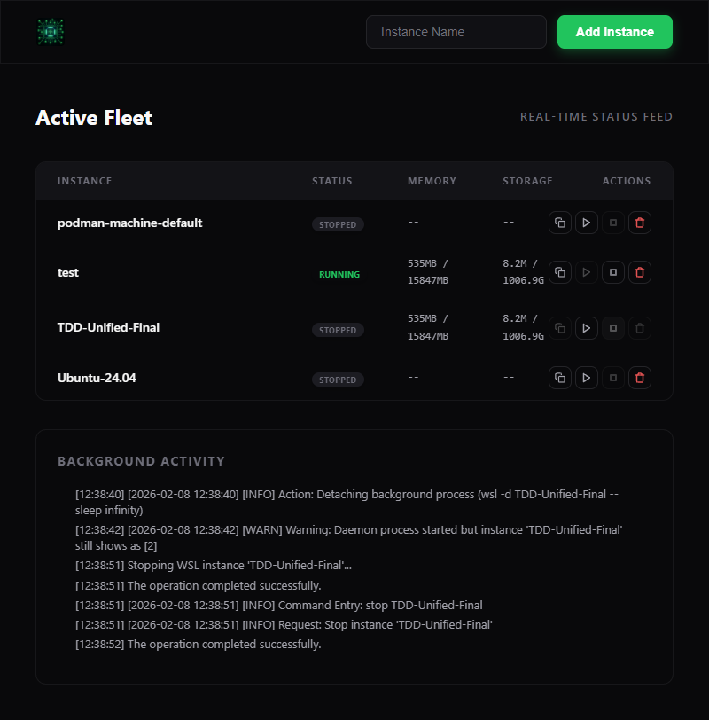
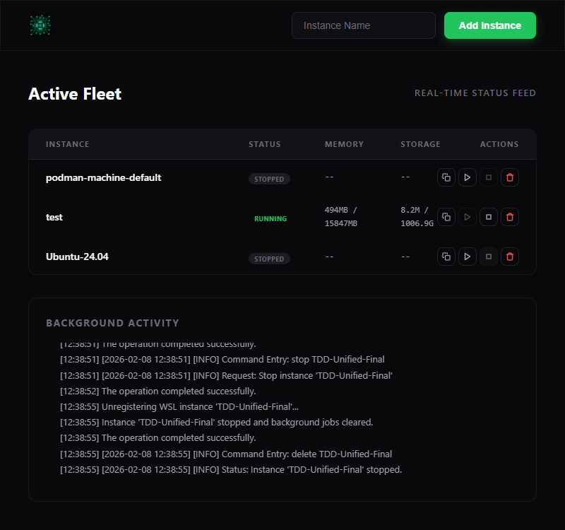

# WSL Dashboard

Management interface for WSL 2 instances. Features real-time telemetry, Alpine Linux provisioning, and integrated verification.

---

## Getting Started

### Prerequisites
- WSL 2 on Windows.
- [Bun](https://bun.sh/).
- PowerShell 5.1+.

### Installation

1. **Clone**:
   ```powershell
   git clone https://github.com/timcash/wsl-tools.git
   cd wsl-tools
   ```

2. **Run Dashboard**:
   ```powershell
   .\wsl_tools.ps1 dashboard
   ```

3. **Fetch Alpine**:
   ```powershell
   .\wsl_tools.ps1 fetch alpine
   ```

---

## CLI Reference

Entry point: `wsl_tools.ps1`.

| Command | Description |
| :--- | :--- |
| `dashboard` | Starts the Bun server. |
| `new <name> [base]` | Creates a new instance. |
| `daemon <name>` | Starts instance in background. |
| `stop <name>` | Stops a running instance. |
| `delete <name>` | Unregisters an instance. |
| `list-json` | Lists instances in JSON. |
| `monitor <name>` | Shows metrics (CPU, Memory, Disk). |

---

## Verification

Runs PowerShell commands then validates via Puppeteer.

```bash
cd src
bun run test.ts
```

---

## Documentation
- **[AGENT.md](AGENT.md)**: Testing workflow and debugging.
- **[system.md](system.md)**: Architecture overview.

# Test Result

**Run:** 2/8/2026, 12:38:58 PM | **Status:** [PASS] PASSED

### [PASS] 1. Backend Infrastructure Ready

```text
[12:38:37] === PHASE 1: BACKEND PREP ===
[12:38:37] [SETUP] Ensuring port 3002 is free...
[12:38:37] [CLEANUP] Removing any lingering TDD- instances...
[12:38:37] [EXEC] wsl_tools.ps1 list-json 
[12:38:38] [PS-STDOUT] [{"Name":"podman-machine-default","State":"Stopped","Version":"2"},{"Name":"test","State":"Running","Version":"2"},{"Name":"Ubuntu-24.04","State":"Stopped","Version":"2"}]
[12:38:38] [EXEC] wsl_tools.ps1 new TDD-Unified-Final alpine
[12:38:38] [PS-STDOUT] Creating new WSL instance 'TDD-Unified-Final' from 'alpine'...
Importing TDD-Unified-Final from C:\Users\timca\WSL\_bases\alpine.tar.gz into C:\Users\timca\WSL\TDD-Unified-Final...
The operation completed successfully. 
Instance 'TDD-Unified-Final' created successfully from C:\Users\timca\WSL\_bases\alpine.tar.gz.
```

### [PASS] 2. Dashboard Initial Load


```text
[12:38:38] === PHASE 2: SERVER START ===
[12:38:38] [SRV-OUT] [BUILD] Transpiling C:\Users\timca\code3\wsl-tools\src\app.ts -> C:\Users\timca\code3\wsl-tools\src\dist
[12:38:38] [SRV-OUT] [BUILD] Success!
[12:38:38] [SRV-OUT] [TAIL] Starting log tail on: C:\Users\timca\code3\wsl-tools\src\powershell.log
[12:38:38] [SRV-OUT] [V2] Dashboard active at http://localhost:3002
[12:38:39] [SRV-OUT] [HTTP] GET / (rel: )
[12:38:39] [SRV-OUT] [HTTP] GET /style.css (rel: style.css)
[12:38:39] [SRV-OUT] [HTTP] GET /app.js (rel: app.js)
[12:38:39] [SRV-OUT] [HTTP] GET /wsl_cpu_network.png (rel: wsl_cpu_network.png)
[12:38:39] [BRW-CONSOLE] [WS] Attempting connection...
[12:38:39] [SRV-OUT] [WS] Client connected
[12:38:39] [BRW-CONSOLE] [WS] Connected to backend
[12:38:39] [SRV-OUT] [HTTP] GET /favicon.ico (rel: favicon.ico)
[12:38:39] [BRW-CONSOLE] Failed to load resource: the server responded with a status of 404 (Not Found)
[12:38:39] [BRW-CONSOLE] [UI_ONLINE] Instance online: test
```

### [PASS] 3. Instance Online & Telemetry Flow


```text
[12:38:40] === PHASE 3: START & TELEMETRY ===
[12:38:40] [BRW-CONSOLE] [UI_DISCOVERY] Ensuring placeholder for: TDD-Unified-Final (Starting)
[12:38:40] [SRV-OUT] [WS] Received: {"type":"start","name":"TDD-Unified-Final"}
[12:38:40] [SRV-OUT] [WS] Parsed Action: start on TDD-Unified-Final
[12:38:40] [SRV-OUT] [SERVER] Executing: da
[12:38:40] [SRV-OUT] emon TDD-Unified-Final
[12:38:40] [SRV-OUT] [PS-OUT] Starting daemon for WSL instance 'TDD-Unified-Final'...
[12:38:40] [SRV-OUT] [PS-LOG] [2026-02-08 12:38:40] [INFO] Command Entry: daemon TDD-Unified-Final
[12:38:40] [SRV-OUT] [PS-LOG] [2026-02-08 12:38:40] [INFO] Request: Sta
[12:38:40] [SRV-OUT] rt daemon for 'TDD-Unified-Final'
[12:38:40] [SRV-OUT] [PS-LOG] [2026-02-08 12:38:40] [INFO] Action: Detaching background process (wsl -d TDD-Unified-Final -- sleep infinity)
[12:38:41] [BRW-CONSOLE] [UI_STOPPED] Instance stopped: podman-machine-default
[12:38:41] [BRW-CONSOLE] [UI_ONLINE] Instance online: test
[12:38:41] [BRW-CONSOLE] [UI_ONLINE] Instance online: TDD-Unified-Final
[12:38:41] [BRW-CONSOLE] [UI_STOPPED] Instance stopped: Ubuntu-24.04
[12:38:41] [SRV-OUT] [STATE] podman-machine-default: Unknown -> Stopped
[12:38:41] [SRV-OUT] [STATE] test: Unknown -> Running
[12:38:42] [SRV-OUT] [STATE] Ubuntu-24.04: Unknown -> Stopped
[12:38:42] [BRW-CONSOLE] [UI_UPDATE] Stats updated: test Mem: 526MB / 15847MB
[12:38:42] [BRW-CONSOLE] [UI_UPDATE] Stats updated: test Disk: 8.2M / 1006.9G
[12:38:42] [SRV-OUT] [PS-LOG] [2026-02-08 12:38:42] [WARN] Warning: Daemon process started but instance 'TDD-Unified-Final' still shows as [2]
[12:38:45] [BRW-CONSOLE] [UI_UPDATE] Stats updated: test Mem: 529MB / 15847MB
[12:38:48] [SRV-OUT] [STATE] TDD-Unified-Final: Unknown -> Running
[12:38:48] [BRW-CONSOLE] [UI_UPDATE] Stats updated: test Mem: 533MB / 15847MB
[12:38:48] [BRW-CONSOLE] [UI_UPDATE] Stats updated: TDD-Unified-Final Mem: 535MB / 15847MB
[12:38:48] [BRW-CONSOLE] [UI_UPDATE] Stats updated: TDD-Unified-Final Disk: 8.2M / 1006.9G
```

### [PASS] 4. Graceful Stop via UI



```text
[12:38:49] === PHASE 4: STOP FLOW ===
[12:38:51] [BRW-CONSOLE] [UI_DISCOVERY] Ensuring placeholder for: TDD-Unified-Final (Stopping)
[12:38:51] [SRV-OUT] [WS] Received: {"type":"terminate","name":"TDD-Unified-Final"}
[12:38:51] [SRV-OUT] [WS] Parsed Action: terminate on TDD-Unified-Final
[12:38:51] [SRV-OUT] [SERVER] Executing: stop TDD-Unified-Final
[12:38:51] [4.1] Clicked Stop button
[12:38:51] [BRW-CONSOLE] [UI_UPDATE] Stats updated: test Mem: 535MB / 15847MB
[12:38:51] [SRV-OUT] [PS-OUT] Stopping WSL instance 'TDD-Unified-Final'...
[12:38:51] [SRV-OUT] [PS-OUT] The operation completed successfully.
[12:38:51] [SRV-OUT] [PS-LOG] [2026-02-08 12:38:51] [INFO] Command Entry: stop TDD-Unified-Final
[12:38:51] [SRV-OUT] [PS-LOG] [2026-02-08 12:38:51] [INFO] Request: Stop instance 'TDD-Unified-Final'
[12:38:52] [BRW-CONSOLE] [UI_STOPPED] Instance stopped: TDD-Unified-Final
[12:38:52] [SRV-OUT] [PS-OUT] The operation completed successfully.
```

### [PASS] 5. Instance Unregistered & UI Cleanup



```text
[12:38:53] === PHASE 5: DELETE FLOW ===
[12:38:54] [BRW-CONSOLE] [UI_UPDATE] Stats updated: test Mem: 495MB / 15847MB
[12:38:55] [5.1] Triggering delete via window.app.delete evaluate...
[12:38:55] [BRW-DIALOG] Are you sure you want to delete TDD-Unified-Final?
[12:38:55] [BRW-CONSOLE] [UI_ACTION] Delete requested for: TDD-Unified-Final
[12:38:55] [BRW-DIALOG] Are you sure you want to delete TDD-Unified-Final?
[12:38:55] [BRW-CONSOLE] [UI_ACTION] Confirmed delete for: TDD-Unified-Final. Sending WS message.
[12:38:55] [BRW-CONSOLE] [UI_DISCOVERY] Ensuring placeholder for: TDD-Unified-Final (Deleting)
[12:38:55] [SRV-OUT] [WS] Received: {"type":"delete","name":"TDD-Unified-Final"}
[12:38:55] [SRV-OUT] [WS] Parsed Action: delete on TDD-Unified-Final
[12:38:55] [SRV-OUT] [SERVER] Executing: delete TDD-Unified-Final
[12:38:55] [SRV-OUT] [PS-OUT] Unregistering WSL instance 'TDD-Unified-Final'...
[12:38:55] [SRV-OUT] [PS-OUT] Instance 'TDD-Unified-Final' stopped and background jobs cleared.
[12:38:55] [SRV-OUT] [PS-OUT] The operation completed successfully.
[12:38:55] [SRV-OUT] [PS-LOG] [2026-02-08 12:38:55] [INFO] Command Entry: delete TDD-Unified-Final
[12:38:55] [SRV-OUT] [PS-LOG] [2026-02-08 12:38:55] [INFO] Status: Instance 'TDD-Unified-Final' stopped.
[12:38:56] [BRW-CONSOLE] [UI_DELETED] Instance removed: TDD-Unified-Final
[12:38:57] [BRW-CONSOLE] [UI_UPDATE] Stats updated: test Mem: 494MB / 15847MB
```

