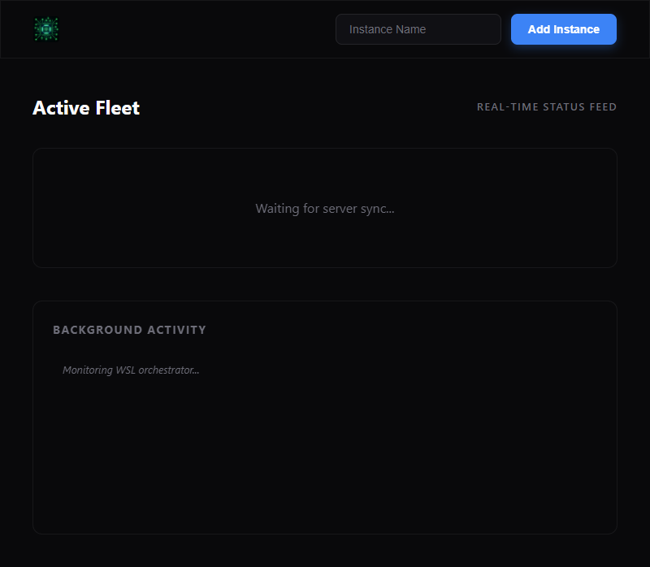

# WSL Dashboard v2

A high-fidelity management interface for WSL 2 instances, built for speed and visual excellence. Features real-time telemetry, automated Alpine Linux provisioning, and a "Backend-First" verification engine.

---

## 🚀 Getting Started

### Prerequisites
- **WSL 2** enabled on Windows.
- **[Bun](https://bun.sh/)**: The fast all-in-one JavaScript runtime.
- **PowerShell 5.1+**.

### Installation & Setup

1. **Clone the Repository**:
   ```powershell
   git clone https://github.com/timcash/wsl-tools.git
   cd wsl-tools
   ```

2. **Start the Dashboard**:
   The dashboard manages its own dependencies and transpilation. Just run:
   ```powershell
   .\wsl_tools.ps1 dashboard
   ```
   Navigate to the logged `http://localhost:PORT`.

3. **Initialize Alpine (Minimal Rootfs)**:
   For ultra-fast instance creation, fetch the mini-rootfs:
   ```powershell
   .\wsl_tools.ps1 fetch alpine
   ```

---

## 🛠️ CLI Reference

The `wsl_tools.ps1` script is the primary entry point for all operations.

| Command | Description |
| :--- | :--- |
| `dashboard` | Starts the Bun dev server with live-reload enabled. |
| `new <name> [base]` | Creates a new instance (defaults to Alpine). |
| `daemon <name>` | Starts the instance in background mode for persistence. |
| `stop <name>` | Gracefully stops a running instance. |
| `delete <name>` | Unregisters and deletes an instance. |
| `list-json` | Provides machine-readable instance states for the UI. |
| `monitor <name>` | Real-time Linux metrics: CPU, Memory, Disk. |

---

## 🧪 Automated Verification

This project features a robust **"Backend-First"** testing strategy. The test suite verifies the physical WSL state via PowerShell before validating the UI representation via headless Puppeteer.

**Run the full suite**:
```bash
cd src
bun run test.ts
```
*The test will automatically spawn its own dashboard server and capture visual audit screenshots.*

---

## 📊 Deployment Docs
- **[AGENT.md](AGENT.md)**: Deep-dive into the testing workflow and debugging guides.
- **[system.md](system.md)**: Architectural overview of the dashboard state machine.


# Test Result

**Last Run:** 2/8/2026, 9:44:23 AM  
**Status:** ❌ FAILED  

### Performance Metrics

| Metric | Value |
| :--- | :--- |
| Total Test Time | 92.61s |
| WSL Instance Start | 30.07s |
| SSH Latency | 52.85ms |
| File Write Latency | 31.41ms |
| Stats Verified | ❌ NO |
| Online Verified | ❌ NO |

### Error Summary

*No errors detected.*

### Visual Verification

#### Initial Load


#### After Adding Instance
❌ FAILED: UI_ONLINE event not received

#### Final State
❌ FAILED: Final verification or Stats update failed

### PowerShell Log Report

```text
[2026-02-08 09:44:08] [INFO] Instance 'Ubuntu-24.04' exists.
[2026-02-08 09:44:11] [INFO] Command Entry: list-json 
[2026-02-08 09:44:11] [INFO] Listing instances (JSON: True)...
[2026-02-08 09:44:11] [DEBUG] Instances found: 2
[2026-02-08 09:44:11] [INFO] Command Entry: monitor-json Ubuntu-24.04
[2026-02-08 09:44:11] [INFO] Checking existence for 'Ubuntu-24.04'...
[2026-02-08 09:44:11] [INFO] Instance 'Ubuntu-24.04' exists.
[2026-02-08 09:44:14] [INFO] Command Entry: list-json 
[2026-02-08 09:44:14] [INFO] Listing instances (JSON: True)...
[2026-02-08 09:44:14] [DEBUG] Instances found: 2
[2026-02-08 09:44:14] [INFO] Command Entry: monitor-json Ubuntu-24.04
[2026-02-08 09:44:14] [INFO] Checking existence for 'Ubuntu-24.04'...
[2026-02-08 09:44:14] [INFO] Instance 'Ubuntu-24.04' exists.
[2026-02-08 09:44:17] [INFO] Command Entry: list-json 
[2026-02-08 09:44:17] [INFO] Listing instances (JSON: True)...
[2026-02-08 09:44:17] [DEBUG] Instances found: 2
[2026-02-08 09:44:17] [INFO] Command Entry: monitor-json Ubuntu-24.04
[2026-02-08 09:44:17] [INFO] Checking existence for 'Ubuntu-24.04'...
[2026-02-08 09:44:17] [INFO] Instance 'Ubuntu-24.04' exists.
[2026-02-08 09:44:20] [INFO] Command Entry: list-json 
[2026-02-08 09:44:20] [INFO] Listing instances (JSON: True)...
[2026-02-08 09:44:20] [DEBUG] Instances found: 2
[2026-02-08 09:44:20] [INFO] Command Entry: monitor-json Ubuntu-24.04
[2026-02-08 09:44:20] [INFO] Checking existence for 'Ubuntu-24.04'...
[2026-02-08 09:44:20] [INFO] Instance 'Ubuntu-24.04' exists.
[2026-02-08 09:44:23] [INFO] Command Entry: list-json 
[2026-02-08 09:44:23] [INFO] Listing instances (JSON: True)...
[2026-02-08 09:44:23] [DEBUG] Instances found: 2
[2026-02-08 09:44:23] [INFO] Command Entry: monitor-json Ubuntu-24.04
[2026-02-08 09:44:23] [INFO] Checking existence for 'Ubuntu-24.04'...
```

## Test Result

**Last Run:** 2/8/2026, 10:12:54 AM  
**Status:** ❌ FAILED  

### Metrics

| Metric | Status |
| :--- | :--- |
| Total Time | 66.20s |
| Backend-First | ❌ Failed |
| Live discovery | ❌ NO |

### Trace
```text
[10:11:47 AM] [TEST] Starting Dashboard Server internally...
[10:11:48 AM] [TEST] Dashboard active at http://localhost:60465
[10:11:48 AM] PHASE 1: Backend Verification (Pre-flight-Backend-Test)
[10:11:48 AM] [BACKEND] Cleaning up potential stale instance: Pre-flight-Backend-Test
[10:11:48 AM] [BACKEND] Running: powershell delete Pre-flight-Backend-Test
[10:11:48 AM] [BACKEND] Running: powershell list-json
[10:11:49 AM] [BACKEND] Initial instance count: 2
[10:11:49 AM] [BACKEND] Running: powershell new Pre-flight-Backend-Test alpine
[10:11:50 AM] [BACKEND] Creation successful.
[10:11:50 AM] ✅ SUCCESS: Backend creation verified in powershell.log
[10:11:51 AM] [BACKEND] Running: powershell list-json
[10:11:51 AM] ✅ SUCCESS: Instance verified via list-json. Count: 3
[10:11:51 AM] [BACKEND] Starting daemon for Pre-flight-Backend-Test
[10:11:51 AM] [BACKEND] Running: powershell daemon Pre-flight-Backend-Test
[10:11:51 AM] PHASE 2: Browser Verification
[10:11:51 AM] [BROWSER][ERROR] Failed to load resource: the server responded with a status of 404 (Not Found)
[10:11:52 AM] [BROWSER][ERROR] error-ping
[10:11:53 AM] Checking for Pre-flight-Backend-Test in UI...
[10:12:53 AM] ❌ FAILED: UI Online event timeout (Pre-flight-Backend-Test)
[10:12:53 AM] ❌ FAILED: Pre-flight-Backend-Test not running or missing from UI.
[10:12:54 AM] [TEST] Stopping Dashboard Server...
```

### UI Errors

*No errors.*

### Visual Audit

#### Ready State


#### Online State
❌ Missing

#### Final State
❌ Missing
