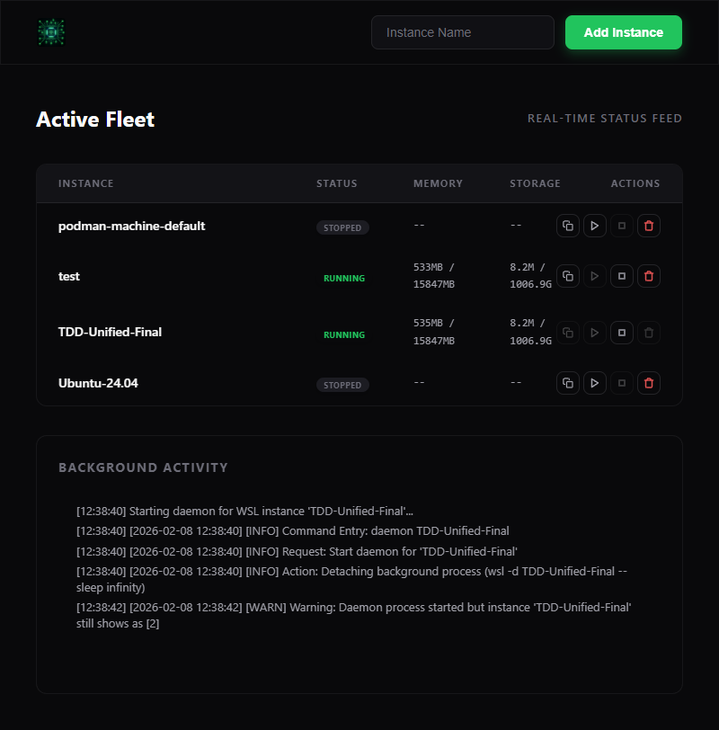

# WSL Dashboard

Management interface for WSL 2 instances. Features real-time telemetry, Alpine Linux provisioning, and integrated verification.

---

## Getting Started

### Prerequisites
- WSL 2 on Windows.
- [Bun](https://bun.sh/).
- PowerShell 5.1+.

### Installation

1. **Clone**:
   ```powershell
   git clone https://github.com/timcash/wsl-tools.git
   cd wsl-tools
   ```

2. **Run Dashboard**:
   ```powershell
   .\wsl_tools.ps1 dashboard
   ```

3. **Fetch Alpine**:
   ```powershell
   .\wsl_tools.ps1 fetch alpine
   ```

---

## CLI Reference

Entry point: `wsl_tools.ps1`.

| Command | Description |
| :--- | :--- |
| `dashboard` | Starts the Bun server. |
| `new <name> [base]` | Creates a new instance. |
| `daemon <name>` | Starts instance in background. |
| `stop <name>` | Stops a running instance. |
| `delete <name>` | Unregisters an instance. |
| `list-json` | Lists instances in JSON. |
| `monitor <name>` | Shows metrics (CPU, Memory, Disk). |

---

## Verification

Runs PowerShell commands then validates via Puppeteer.

```bash
cd src
bun run test.ts
```

---

## Documentation
- **[AGENT.md](AGENT.md)**: Testing workflow and debugging.
- **[system.md](system.md)**: Architecture overview.

# Test Result

**Run:** 2/8/2026, 1:36:44 PM | **Status:** 🟢 PASSED

### ✅ 1. Backend Infrastructure Ready

```text
[13:36:28] === PHASE 1: BACKEND PREP ===
[13:36:28] [SETUP] Ensuring port 3002 is free...
[13:36:29] [CLEANUP] Removing any lingering TDD- instances...
[13:36:29] [EXEC] wsl_tools.ps1 list-json 
[13:36:29] [PS-STDOUT] [{"Name":"podman-machine-default","State":"Stopped","Version":"2","Persisted":false},{"Name":"Ubuntu-24.04","State":"Running","Version":"2","Persisted":false},{"Name":"TDD-Unified-Final","State":"Running","Version":"2","Persisted":false}]
[13:36:29] [CLEANUP] Deleting TDD-Unified-Final
[13:36:29] [EXEC] wsl_tools.ps1 delete TDD-Unified-Final
[13:36:33] [PS-STDOUT] Stopping WSL instance 'TDD-Unified-Final'...
The operation completed successfully. 
The operation completed successfully. 
Instance 'TDD-Unified-Final' stopped and background jobs cleared.
Unregistering WSL instance 'TDD-Unified-Final'...
The operation completed successfully. 

[13:36:33] [EXEC] wsl_tools.ps1 new TDD-Unified-Final alpine
[13:36:34] [PS-STDOUT] Creating new WSL instance 'TDD-Unified-Final' from 'alpine'...
Importing TDD-Unified-Final from C:\Users\timca\WSL\_bases\alpine.tar.gz into C:\Users\timca\WSL\TDD-Unified-Final...
The operation completed successfully. 
Instance 'TDD-Unified-Final' created successfully from C:\Users\timca\WSL\_bases\alpine.tar.gz.
```

### ✅ 2. Dashboard Initial Load


```text
[13:36:34] === PHASE 2: SERVER START ===
[13:36:34] [SRV-OUT] [BUILD] Transpiling C:\Users\timca\code3\wsl-tools\src\app.ts -> C:\Users\timca\code3\wsl-tools\src\dist
[13:36:34] [SRV-OUT] [BUILD] Success!
[13:36:34] [SRV-OUT] [TAIL] Starting log tail on: C:\Users\timca\code3\wsl-tools\src\powershell.log
[13:36:34] [SRV-OUT] [V2] Dashboard active at http://localhost:3002
[13:36:35] [SRV-OUT] [HTTP] GET / (rel: )
[13:36:35] [SRV-OUT] [HTTP] GET /style.css (rel: style.css)
[13:36:35] [SRV-OUT] [HTTP] GET /app.js (rel: app.js)
[13:36:35] [SRV-OUT] [HTTP] GET /wsl_cpu_network.png (rel: wsl_cpu_network.png)
[13:36:35] [BRW-CONSOLE] [WS] Attempting connection...
[13:36:35] [SRV-OUT] [WS] Client connected
[13:36:35] [BRW-CONSOLE] [WS] Connected to backend
[13:36:35] [SRV-OUT] [HTTP] GET /favicon.ico (rel: favicon.ico)
[13:36:35] [BRW-CONSOLE] Failed to load resource: the server responded with a status of 404 (Not Found)
```

### ✅ 7. OS Persistence Verified (Windows Task Scheduler)



```text
[13:36:36] === PHASE 7: OS PERSISTENCE (TASK SCHEDULER) ===
[13:36:36] [7.1] Registering persistence for reboot...
[13:36:36] [EXEC] wsl_tools.ps1 persist TDD-Unified-Final
[13:36:36] [SRV-OUT] [PS-LOG] [2026-02-08 13:36:36] [INFO] Command Entry: persist TDD-Unified-Final
[13:36:36] [WS_RECV] {"type":"ps-log","data":"[2026-02-08 13:36:36] [INFO] Command Entry: persist TDD-Unified-Final"}
[13:36:36] [PS-STDOUT] Registering Windows Task 'WSL_Persist_TDD-Unified-Final' for reboot persistence...

TaskPath                                       TaskName                          State     
--------                                       --------                          -----     
\                                              WSL_Persist_TDD-Unified-Final     Ready     
Task registered. TDD-Unified-Final will now start automatically when you log in.
[13:36:36] [7.2] Verifying task existence via Get-ScheduledTask...
[13:36:37] [7.3] Windows Scheduled Task verified. It will survive reboots.
[13:36:37] [7.4] Testing unpersist cleanup...
[13:36:37] [EXEC] wsl_tools.ps1 unpersist TDD-Unified-Final
[13:36:38] [SRV-OUT] [STATE] podman-machine-default: Unknown -> Stopped
[13:36:38] [SRV-OUT] [STATE] TDD-Unified-Final: Unknown -> Stopped
[13:36:38] [SRV-OUT] [STATE] Ubuntu-24.04: Unknown -> Running
[13:36:38] [WS_RECV] {"type":"list","data":[{"Name":"podman-machine-default","State":"Stopped","Version":"2","Persisted":false},{"Name":"TDD-Unified-Final","State":"Stopped","Version":"2","Persisted":true},{"Name":"Ubuntu-24.04","State":"Running","Version":"2","Persisted":false}]}
[13:36:38] [BRW-CONSOLE] [UI_STOPPED] Instance stopped: podman-machine-default
[13:36:38] [BRW-CONSOLE] [UI_STOPPED] Instance stopped: TDD-Unified-Final
[13:36:38] [BRW-CONSOLE] [UI_ONLINE] Instance online: Ubuntu-24.04
[13:36:38] [SRV-OUT] [PS-LOG] [2026-02-08 13:36:37] [INFO] Command Entry: unpersist TDD-Unified-Final
[13:36:38] [WS_RECV] {"type":"ps-log","data":"[2026-02-08 13:36:37] [INFO] Command Entry: unpersist TDD-Unified-Final"}
[13:36:38] [PS-STDOUT] Removing Windows Task 'WSL_Persist_TDD-Unified-Final'...
[13:36:38] [WS_RECV] {"type":"stats","data":{"InstanceName":"Ubuntu-24.04","Timestamp":"2026-02-08 13:36:38","Memory":"808MB / 15847MB","Disk":"40G / 1007G"}}
[13:36:38] [BRW-CONSOLE] [UI_UPDATE] Stats updated: Ubuntu-24.04 Mem: 808MB / 15847MB
[13:36:38] [BRW-CONSOLE] [UI_UPDATE] Stats updated: Ubuntu-24.04 Disk: 40G / 1007G
[13:36:39] [7.5] OS Persistence cleanup verified.
```

