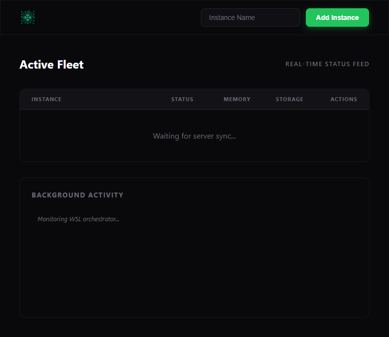

# WSL Dashboard

Management interface for WSL 2 instances. Features real-time telemetry, Alpine Linux provisioning, and integrated verification.

---

## Getting Started

### Prerequisites
- WSL 2 on Windows.
- [Bun](https://bun.sh/).
- PowerShell 5.1+.

### Installation

1. **Clone**:
   ```powershell
   git clone https://github.com/timcash/wsl-tools.git
   cd wsl-tools
   ```

2. **Run Dashboard**:
   ```powershell
   .\wsl_tools.ps1 dashboard
   ```

3. **Fetch Alpine**:
   ```powershell
   .\wsl_tools.ps1 fetch alpine
   ```

---

## CLI Reference

Entry point: `wsl_tools.ps1`.

| Command | Description |
| :--- | :--- |
| `dashboard` | Starts the Bun server. |
| `new <name> [base]` | Creates a new instance. |
| `daemon <name>` | Starts instance in background. |
| `stop <name>` | Stops a running instance. |
| `delete <name>` | Unregisters an instance. |
| `list-json` | Lists instances in JSON. |
| `monitor <name>` | Shows metrics (CPU, Memory, Disk). |

---

## Verification

Runs PowerShell commands then validates via Puppeteer.

```bash
cd src
bun run test.ts
```

---

## Documentation
- **[AGENT.md](AGENT.md)**: Testing workflow and debugging.
- **[system.md](system.md)**: Architecture overview.

# Test Result

**Run:** 2/8/2026, 1:42:11 PM | **Status:** 🔴 FAILED

> ⚠️ **ERROR SUMMARY**: FAILED: Start/Stats timeout

### ✅ 1. Backend Infrastructure Ready

```text
[13:41:02] === PHASE 1: BACKEND PREP ===
[13:41:02] [SETUP] Ensuring port 3002 is free...
[13:41:03] [CLEANUP] Removing any lingering TDD- instances...
[13:41:03] [EXEC] wsl_tools.ps1 list-json 
[13:41:04] [PS-STDOUT] [{"Name":"podman-machine-default","State":"Stopped","Version":"2","Persisted":false},{"Name":"Ubuntu-24.04","State":"Running","Version":"2","Persisted":false},{"Name":"Backend-Verify-Inst","State":"Stopped","Version":"2","Persisted":false}]
[13:41:04] [EXEC] wsl_tools.ps1 new TDD-Unified-Final alpine
[13:41:04] [PS-STDOUT] Creating new WSL instance 'TDD-Unified-Final' from 'alpine'...
Importing TDD-Unified-Final from C:\Users\timca\WSL\_bases\alpine.tar.gz into C:\Users\timca\WSL\TDD-Unified-Final...
The operation completed successfully. 
Instance 'TDD-Unified-Final' created successfully from C:\Users\timca\WSL\_bases\alpine.tar.gz.
```

### ✅ 2. Dashboard Initial Load



```text
[13:41:04] === PHASE 2: SERVER START ===
[13:41:04] Waiting for server on port 3002...
[13:41:04] [SRV-OUT] [BUILD] Transpiling C:\Users\timca\code3\wsl-tools\src\app.ts -> C:\Users\timca\code3\wsl-tools\src\dist
[13:41:04] [SRV-OUT] [BUILD] Success!
[13:41:04] [SRV-OUT] [TAIL] Starting log tail on: C:\Users\timca\code3\wsl-tools\src\powershell.log
[13:41:04] [SRV-OUT] [V2] Dashboard active at http://localhost:3002
[13:41:05] [SRV-OUT] [HTTP] GET / (rel: )
[13:41:05] [SRV-OUT] [HTTP] GET /style.css (rel: style.css)
[13:41:05] [SRV-OUT] [HTTP] GET /app.js (rel: app.js)
[13:41:05] [SRV-OUT] [HTTP] GET /wsl_cpu_network.png (rel: wsl_cpu_network.png)
[13:41:05] [BRW-CONSOLE] [WS] Attempting connection...
[13:41:05] [SRV-OUT] [WS] Client connected
[13:41:05] [BRW-CONSOLE] [WS] Connected to backend
[13:41:05] [SRV-OUT] [HTTP] GET /favicon.ico (rel: favicon.ico)
[13:41:05] [BRW-CONSOLE] Failed to load resource: the server responded with a status of 404 (Not Found)
```

### ❌ FAILED: Start/Stats timeout

```text
[13:41:06] === PHASE 3: START & TELEMETRY ===
[13:41:06] [WS_RECV] {"type":"list","data":[{"Name":"podman-machine-default","State":"Stopped","Version":"2","Persisted":false},{"Name":"Ubuntu-24.04","State":"Running","Version":"2","Persisted":false},{"Name":"TDD-Unified-Final","State":"Stopped","Version":"2","Persisted":false},{"Name":"Backend-Verify-Inst","State":"Stopped","Version":"2","Persisted":false}]}
[13:41:06] [BRW-CONSOLE] [UI_ONLINE] Instance online: Ubuntu-24.04
[13:41:06] [BRW-CONSOLE] [UI_DISCOVERY] Ensuring placeholder for: TDD-Unified-Final (Starting)
[13:41:06] [SRV-OUT] [WS] Received: {"type":"daemon","name":"TDD-Unified-Final"}
[13:41:06] [SRV-OUT] [WS] Parsed Action: daemon on TDD-Unified-Final
[13:41:06] [SRV-OUT] [SERVER] Executing: daemon & persist TDD-Unified-Final
[13:41:06] [SRV-OUT] [PS-OUT] Starting self-healing daemon for WSL instance 'TDD-Unified-Final'...
[13:41:06] [WS_RECV] {"type":"ps-log","data":"Starting self-healing daemon for WSL instance 'TDD-Unified-Final'..."}
[13:41:06] [SRV-OUT] [PS-OUT] Id     Name            PSJobTypeName   State         HasMoreData     Location             Command
[13:41:06] [WS_RECV] {"type":"ps-log","data":"Id     Name            PSJobTypeName   State         HasMoreData     Location             Command"}
[13:41:06] [SRV-OUT] [PS-OUT] --     ----            -------------   -----         -----------     --------             -------
[13:41:06] [SRV-OUT] [PS-OUT] 1      WSL_Daemon_T... BackgroundJob   Running       True            localhost            ...
[13:41:06] [WS_RECV] {"type":"ps-log","data":"--     ----            -------------   -----         -----------     --------             -------"}
[13:41:06] [WS_RECV] {"type":"ps-log","data":"1      WSL_Daemon_T... BackgroundJob   Running       True            localhost            ..."}
[13:41:06] [SRV-OUT] [PS-LOG] [2026-02-08 13:41:06] [INFO] Command Entry: daemon TDD-Unified-Final
[13:41:06] [WS_RECV] {"type":"ps-log","data":"[2026-02-08 13:41:06] [INFO] Command Entry: daemon TDD-Unified-Final"}
[13:41:06] [SRV-OUT] [PS-LOG] [2026-02-08 13:41:06] [INFO] Request: Start daemon (self-healing) for 'TDD-Unified-Final'
[13:41:06] [SRV-OUT] [PS-LOG] [2026-02-08 13:41:06] [INFO] Action: Detached self-healing job (WSL_Daemon_TDD-Unified-Final)
[13:41:06] [SRV-OUT] [PS-LOG] [2026-02-08 13:41:06] [INFO] [DAEMON] Daemon loop started for TDD-Unified-Final
... (omitted for brevity) ...
[13:41:48] [WS_RECV] {"type":"stats","data":{"InstanceName":"Ubuntu-24.04","Timestamp":"2026-02-08 13:41:48","Memory":"891MB / 15847MB","Disk":"40G / 1007G"}}
[13:41:48] [BRW-CONSOLE] [UI_UPDATE] Stats updated: Ubuntu-24.04 Mem: 891MB / 15847MB
[13:41:50] [WS_RECV] {"type":"list","data":[{"Name":"podman-machine-default","State":"Stopped","Version":"2","Persisted":false},{"Name":"Ubuntu-24.04","State":"Running","Version":"2","Persisted":false},{"Name":"TDD-Unified-Final","State":"Running","Version":"2","Persisted":false},{"Name":"Backend-Verify-Inst","State":"Stopped","Version":"2","Persisted":false}]}
[13:41:51] [WS_RECV] {"type":"stats","data":{"InstanceName":"Ubuntu-24.04","Timestamp":"2026-02-08 13:41:51","Memory":"892MB / 15847MB","Disk":"40G / 1007G"}}
[13:41:51] [BRW-CONSOLE] [UI_UPDATE] Stats updated: Ubuntu-24.04 Mem: 892MB / 15847MB
[13:41:53] [WS_RECV] {"type":"list","data":[{"Name":"podman-machine-default","State":"Stopped","Version":"2","Persisted":false},{"Name":"Ubuntu-24.04","State":"Running","Version":"2","Persisted":false},{"Name":"TDD-Unified-Final","State":"Running","Version":"2","Persisted":false},{"Name":"Backend-Verify-Inst","State":"Stopped","Version":"2","Persisted":false}]}
[13:41:54] [WS_RECV] {"type":"stats","data":{"InstanceName":"Ubuntu-24.04","Timestamp":"2026-02-08 13:41:54","Memory":"889MB / 15847MB","Disk":"40G / 1007G"}}
[13:41:54] [BRW-CONSOLE] [UI_UPDATE] Stats updated: Ubuntu-24.04 Mem: 889MB / 15847MB
[13:41:56] [WS_RECV] {"type":"list","data":[{"Name":"podman-machine-default","State":"Stopped","Version":"2","Persisted":false},{"Name":"Ubuntu-24.04","State":"Running","Version":"2","Persisted":false},{"Name":"TDD-Unified-Final","State":"Running","Version":"2","Persisted":false},{"Name":"Backend-Verify-Inst","State":"Stopped","Version":"2","Persisted":false}]}
[13:41:57] [WS_RECV] {"type":"stats","data":{"InstanceName":"Ubuntu-24.04","Timestamp":"2026-02-08 13:41:57","Memory":"890MB / 15847MB","Disk":"40G / 1007G"}}
[13:41:57] [BRW-CONSOLE] [UI_UPDATE] Stats updated: Ubuntu-24.04 Mem: 890MB / 15847MB
[13:41:59] [WS_RECV] {"type":"list","data":[{"Name":"podman-machine-default","State":"Stopped","Version":"2","Persisted":false},{"Name":"Ubuntu-24.04","State":"Running","Version":"2","Persisted":false},{"Name":"TDD-Unified-Final","State":"Running","Version":"2","Persisted":false},{"Name":"Backend-Verify-Inst","State":"Stopped","Version":"2","Persisted":false}]}
[13:42:00] [WS_RECV] {"type":"stats","data":{"InstanceName":"Ubuntu-24.04","Timestamp":"2026-02-08 13:42:00","Memory":"892MB / 15847MB","Disk":"40G / 1007G"}}
[13:42:00] [BRW-CONSOLE] [UI_UPDATE] Stats updated: Ubuntu-24.04 Mem: 892MB / 15847MB
[13:42:02] [WS_RECV] {"type":"list","data":[{"Name":"podman-machine-default","State":"Stopped","Version":"2","Persisted":false},{"Name":"Ubuntu-24.04","State":"Running","Version":"2","Persisted":false},{"Name":"TDD-Unified-Final","State":"Running","Version":"2","Persisted":false},{"Name":"Backend-Verify-Inst","State":"Stopped","Version":"2","Persisted":false}]}
[13:42:03] [WS_RECV] {"type":"stats","data":{"InstanceName":"Ubuntu-24.04","Timestamp":"2026-02-08 13:42:03","Memory":"891MB / 15847MB","Disk":"40G / 1007G"}}
[13:42:03] [BRW-CONSOLE] [UI_UPDATE] Stats updated: Ubuntu-24.04 Mem: 891MB / 15847MB
[13:42:05] [WS_RECV] {"type":"list","data":[{"Name":"podman-machine-default","State":"Stopped","Version":"2","Persisted":false},{"Name":"Ubuntu-24.04","State":"Running","Version":"2","Persisted":false},{"Name":"TDD-Unified-Final","State":"Running","Version":"2","Persisted":false},{"Name":"Backend-Verify-Inst","State":"Stopped","Version":"2","Persisted":false}]}
[13:42:06] [WS_RECV] {"type":"stats","data":{"InstanceName":"Ubuntu-24.04","Timestamp":"2026-02-08 13:42:06","Memory":"891MB / 15847MB","Disk":"40G / 1007G"}}
[13:42:06] 
[FAIL] FAILURE: Start/Stats timeout
```

