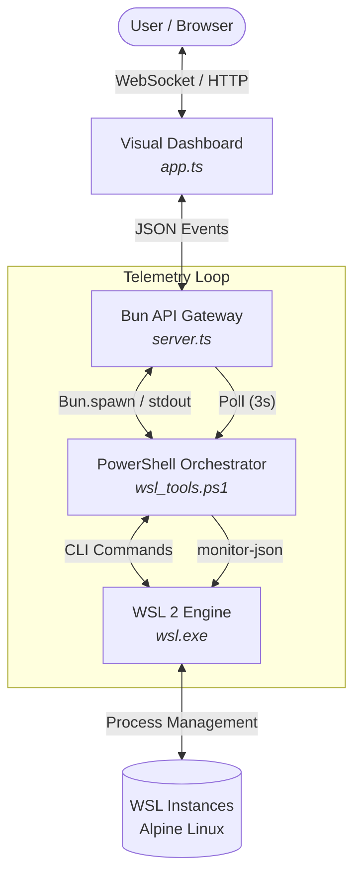

# WSL Tools System Documentation

WSL Tools manages WSL 2 instances using PowerShell for orchestration and Bun for the dashboard.

## Architectural Overview

The system consists of three parts:

1.  **Orchestration Layer (`wsl_tools.ps1`)**: PowerShell script that interfaces with the WSL CLI. It handles fetching rootfs, creating instances, and monitoring.
2.  **API Gateway (`server.ts`)**: Bun backend that serves the dashboard and provides WebSocket updates. It runs PowerShell commands via `Bun.spawn`.
3.  **Visualization Layer (`app.ts`)**: A dashboard that provides visual feedback for WSL operations.

## System Interaction Diagram

The following diagram illustrates the flow of commands and data through the system:

## Component Breakdown

### 🛠️ PowerShell Orchestrator (`wsl_tools.ps1`)
- **Purpose**: The primary interface for WSL lifecycle management.
- **Key Functions**:
    - `fetch`: Downloads minimal Alpine Linux rootfs.
    - `new`: Imports and initializes new instances.
    - `daemon`: Spawns background jobs to keep instances alive.
    - `monitor-json`: Emits telemetry (CPU, Mem, Disk) as structured JSON.
- **Internal Logic**: Cleans UTF-16LE null bytes from `wsl.exe` output to ensure reliable parsing in modern runtimes.

### 🌐 Bun API Gateway (`server.ts`)
- **Purpose**: Bridge between the web frontend and local PowerShell logic.
- **Protocol**: 
    - **HTTP**: Serves static assets and the dashboard SPA.
    - **WebSockets**: Broadcasts "fleet" state and individual "stats" updates.
- **Management**: Spawns PowerShell processes with `Bypass` execution policy to ensure compatibility.

### 📊 Visual Dashboard (`app.ts`)
- **Purpose**: Real-time management interface.
- **Features**:
    - **State Reconciliation**: Prevents UI flickering during WSL imports by tracking transitions.
    - **Telemetery Mapping**: Visualizes memory and disk usage.
    - **One-Click Terminals**: Copy-paste access for `wsl -d <name>`.

## Communication Protocols

| Interface | Type | Data Format | Description |
| :--- | :--- | :--- | :--- |
| **Web -> Gateway** | WebSocket | JSON | Action triggers (`create`, `start`, `terminate`) |
| **Gateway -> Web** | WebSocket | JSON | Broadcast of `list` and `stats` updates |
| **Gateway -> PS** | CLI Spawning | Arg String | Execution of `wsl_tools.ps1` commands |
| **PS -> Gateway** | Stdout | JSON String | Telemetry and instance metadata |
